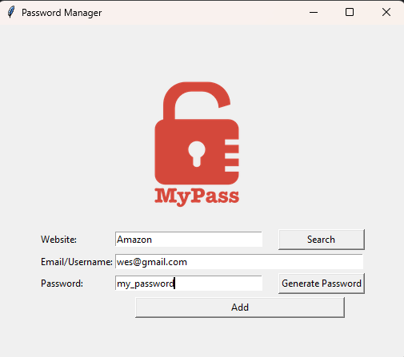

# Password Manager
A simple, interactive password manager built using Python and Tkinter. This application allows users to generate strong passwords, copy them to the clipboard, and save login credentials (website, email/username, password) to a text file using a clean graphical interface.

## Preview



## Features

- A GUI-based password manager built with Python and Tkinter. It allows users to:
- Save and manage credentials (website, username/email, password)
- Generate secure random passwords
- Search for saved credentials
- Automatically copy passwords to the clipboard
- Store data persistently in a JSON file using a pandas DataFrame

## Dependencies

- Python 3.x
- Tkinter (`tkinter`)
- Pillow (`PIL.Image`, `ImageTk`)
- Pandas (`pandas`)
- Pyperclip (`pyperclip`)
- Passwords will be saved in 'passwords_file_ex.json' which will be created if it doesn't exist when running the program

## How to Run

   ```bash
   git clone https://github.com/JWesP23/Password-Manager.git
   cd Password-Manager
   pip install pandas pillow pyperclip
   python main.py
